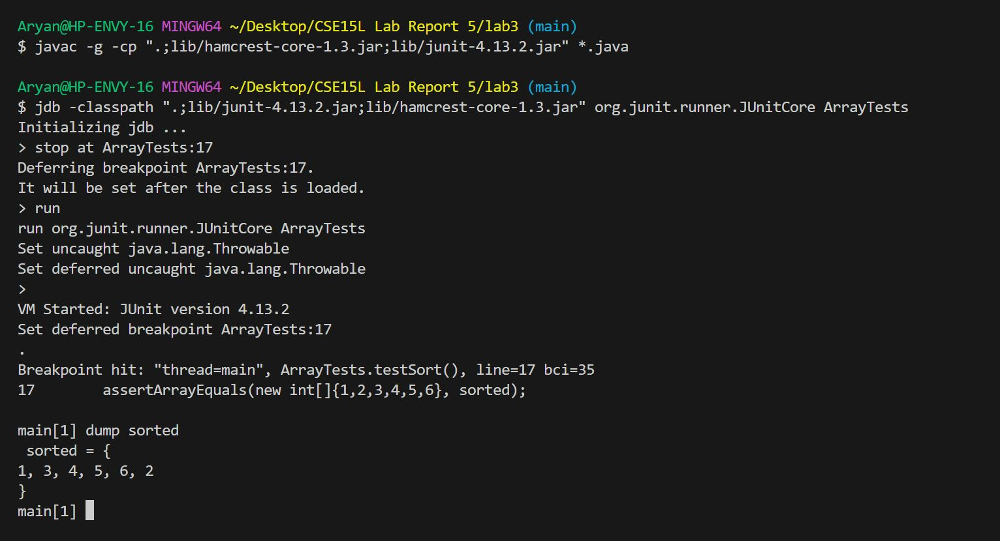

# Lab Report 5

## EdStem Post

**Student,** <br><br>
Hi, I am getting the following error after running tests on the `sort` method within the `Arrays.java` file. The `sort` method is supposed to sort the given array in ascending order. The failure inducing input is the array `{3,4,5,6,1,2}`. I think the error is in the implementation of the sort method but I am not able to find where exactly.

 <br><br>

JUnit Test code for the method <br>
```

 @Test
  public void testSort() {
    int[] input1 = {3,4,5,6,1,2};
    int[] sorted = Arrays.sort(input1);
    assertArrayEquals(new int[]{1,2,3,4,5,6}, sorted);
  }

```

**TA,** <br><br>
Hi, I suggest running `jdb` (Java Debugger) on the test file and making a breakpoint at the line where `assertArrayEquals` is so you can inspect the contents of the sorted array at each index before its compared to the correct sorted array. After the inspection you should find the bug in the `sort` method. 

**Student,** <br><br>
After running `jdb` on the test file and inspecting the values of the sorted array, I found out that the value at the last index is not getting sorted. <br>
The code for the sort method is: 
```
 static int[] sort(int[] arr) {

    // Start replacing smallest values starting from the beginning of the array
    int arrayLength = arr.length;

    for(int i = 0; i < arrayLength-1; i++) {

      // Finds the minimum element after the index
      int minIndex= i;
      
      for(int j = minIndex+1; j < arrayLength-1; j++) {

        if(arr[j] < arr[minIndex]) {

          minIndex = j;
        }
      }

      // Swap the found minimum element with the first element 
      int temp = arr[i];
      arr[i] = arr[minIndex];
      arr[minIndex] = temp;
    }

    return arr;
  }
```



